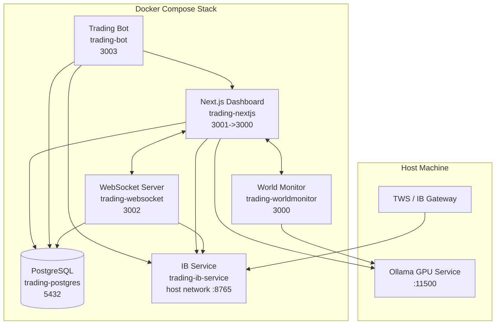
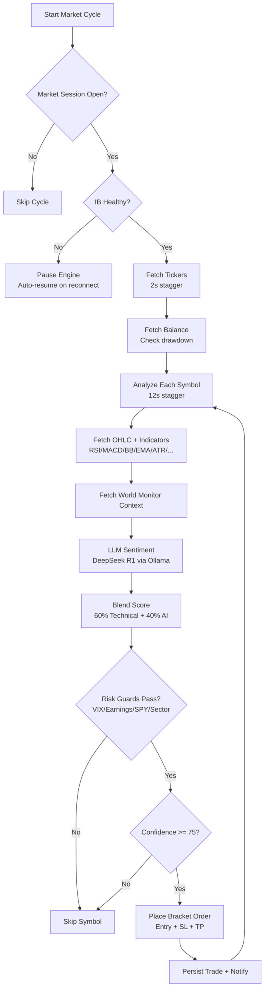
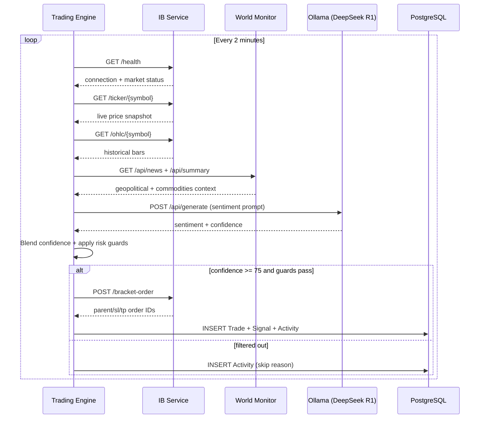
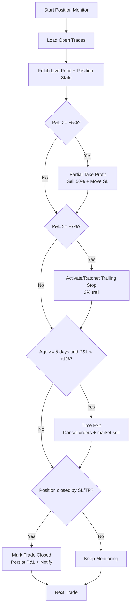
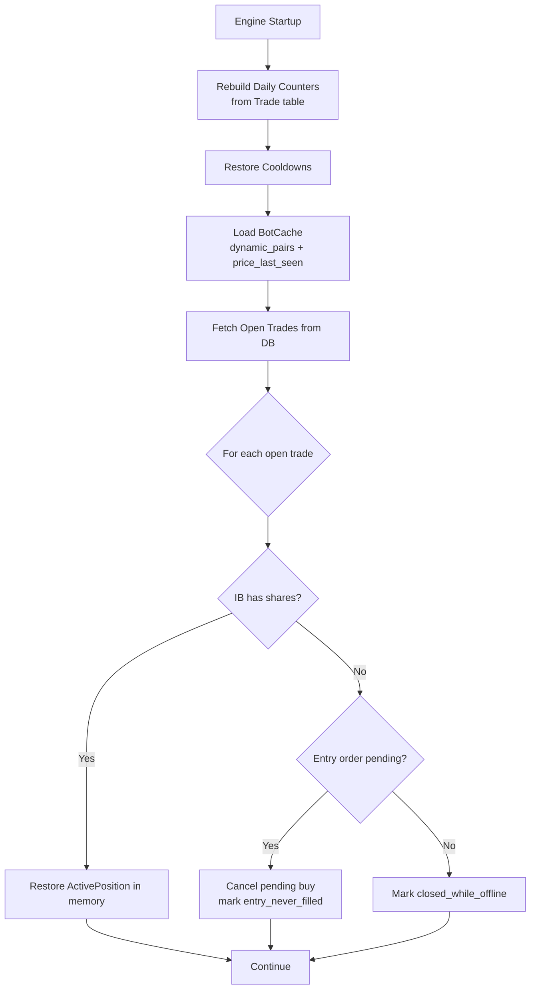

# AI Trading Bot Mermaid Diagrams

These diagrams are derived from `ARCHITECTURE.md`.

## 1) Infrastructure (Docker + Host Services)

## 2) Autonomous Trading Cycle (Every 2 Minutes)

## 3) End-to-End Signal Execution Sequence

## 4) Position Monitoring (Every 30 Seconds)

## 5) Startup Recovery Flow

